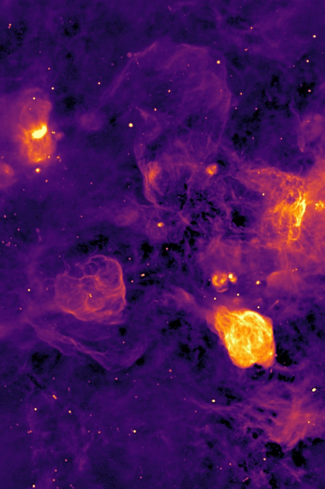
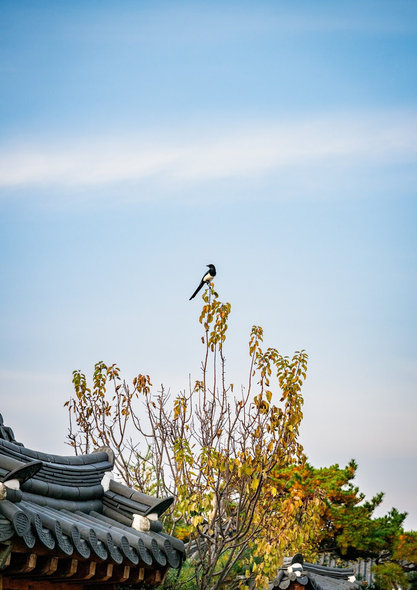
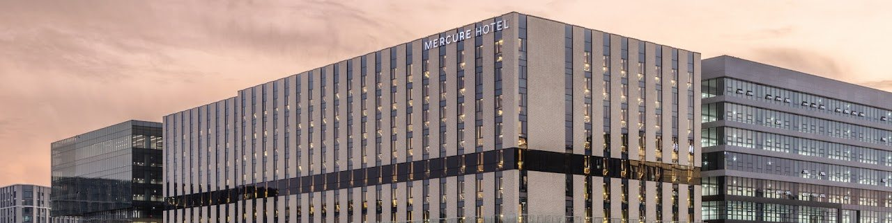

# Home

::: deadlines
2026-04-15 | Abstract submission is open
2026-05-31 | Abstract submission closed — under evaluation
2026-07-06 | Regular registration is open
2026-07-29 | Program announcement
2026-08-31 | Poster abstract submission closed
2026-08-31 | Registration & payment deadline
:::

::: split 2:1
## Scientific Rationale

The SKA Pathfinder Radio Continuum Survey (SPARCS) Working Group began back in 2011 with the following goals:

- To coordinate developments of techniques, to avoid duplication of effort and ensure that each project has access to best practices
- To hold cross-project discussions of the specific science goals, to ensure cross-fertilisation of ideas and optimum survey strategies
- To coordinate the surveys in their choice of area, depth, location on the sky, and other survey parameters, to maximise the scientific return from the surveys
- To distil the SKA Pathfinder experiences as an input to the SKA

We invite talks from anyone working on surveys with pathfinders, precursors, or early SKA. The topics can be scientific as well as technical or methods-related.

## Registration fee

We have a registration fee that varies by group.

- Standard, in-person: 150,000 KRW (~90 Euro)
- Standard, online: 120,000 KRW (~70 Euro)
- Student/ECR[^ecr]: 80,000 KRW (~50 Euro)

[^ecr]: Early Career Researcher — maximum 5 years since PhD.

---

:::

## Meeting Information

The meeting this year will be held October 19th–23rd, 2026, in Seoul, South Korea, and will be hosted by SKA-Korea and the Korean Astronomical Society (KAS). This event is officially sponsored by the Seoul Metropolitan Government and Seoul Tourism Organization.

The meeting is strongly encouraged as an in-person event to maximize interaction and networking between communities, while a limited number of online participants will be accommodated where necessary. The venue can hold up to 100 people, so places are first-come, first-served, and a waitlist will open once capacity is reached.

## Confirmed Invited Speakers

::: card accent=yes
::: people sort=name as=grid stack=yes count=no min=230px
Alec Thomson | SKAO
Bong Won Sohn | KASI
Christian Groeneveld | INAF-IRA
Eric F Jimenez Andrade | IRyA/UNAM
Henrik Edler | ASTRON
Kathryn Ross | AusSRC-Curtin University, Online
Konstantinos Kolokythas | Rhodes University/SARAO, Online
Lennart Heino | IDIA
Sthabile Kolwa | UNISA, Online
Tessa Vernstrom | CSIRO
:::
:::

## Organizing Committee

::: split 1:2
### SOC

::: people sort=name as=list count=no
Kenda Knowles
Yjan Gordon
Wonki Lee
Francesca Loi
Jeroen Stil
Roland Timmerman
Mattia Vaccari
Tessa Vernstrom
:::

---

### LOC

::: people sort=name as=grid
Bong Won Sohn | KASI
Daehyun Kim | Sejong
Dahee Lee | Chosun
Dongmin Kang | Sejong
Eojin Ryu | Chosun
Hyewon Son | Sejong
Hyobin Im | KASI/UST
Jae-Young Kim | UNIST
Jeffrey Hodgson | Sejong
Jongho Park | KHU
Junhan Kim | KAIST
Mingyu Ryu | UNIST
Minji Kim | KASI/UST
Minji Oh | Chosun
Se-Heon Oh | Sejong
SeungYeon Lee | UNIST
Sieun Go | KASI/UST
Siyeon Namkung | Sejong
Soyeon Yeo | Yonsei
Wonki Lee | Yonsei
Yeji Jo | KHU
Yunjeong Lee | KHU
Yura Lee | Sejong
:::
:::

## More about SPARCS

- [Join the Slack](https://join.slack.com/t/sparcs-team/shared_invite/zt-tj3rhbev-VZTOuROctIgxRzCWoFKcMg)
- [SPARCS Wiki](http://spacs.pbworks.com/w/page/26926199/FrontPage)

## Sponsorship

::: logos
KASI | files/logo-kasi.png | https://www.kasi.re.kr
Korean Astronomical Society | files/logo-kas.png
KAIST | files/logo-kaist.png
Seoul Metropolitan Government | files/logo-seoul.png
:::

## Code of Conduct

The organisers are committed to making this meeting productive and enjoyable for everyone, regardless of gender, sexual orientation, disability, physical appearance, body size, race, nationality, or religion. We will not tolerate harassment of participants in any form. Please follow these guidelines:

- Behave professionally. Harassment and sexist, racist, or exclusionary comments or jokes are not appropriate. Harassment includes sustained disruption of talks or other events, inappropriate physical contact, sexual attention or innuendo, deliberate intimidation, stalking, and photography or recording of an individual without consent. It also includes offensive comments related to gender, sexual orientation, disability, physical appearance, body size, race or religion.
- All communication should be appropriate for a professional audience, including people of many different backgrounds. Sexual language and imagery is not appropriate.
- Be kind to others. Do not insult or put down other attendees.

Participants asked to stop any inappropriate behaviour are expected to comply immediately. Attendees violating these rules may be asked to leave the event at the sole discretion of the organisers without a refund of any charge. Any participant who wishes to report a violation of this policy is asked to speak, in confidence, to any of the LOC or SOC members.

This code of conduct is based on the "London Code of Conduct", as originally designed for the conference "Accurate Astrophysics. Correct Cosmology", held in London in July 2015. The London Code of Conduct was adapted with permission by Andrew Pontzen and Hiranya Peiris from a document by Software Carpentry, which itself derives from original Creative Commons documents by PyCon and Geek Feminism. It is released under a CC-Zero licence for reuse. To help track people's improvements and best practices, please retain this acknowledgement, and log your re-use or modification of this policy at <https://github.com/apontzen/london_cc>

# Program

The detailed programme will be announced in due course. *(The table below is a
placeholder used to test the new format — times are computed from durations.)*

::: program
2026-10-19 | 09:30 | Day 1
  session Session 1 | chair Tessa Vernstrom
  10 | Bong Won Sohn | KASI | Welcome and local information
  25 | Tessa Vernstrom | CSIRO | SPARCS: where we stand
  20 | Alec Thomson | SKAO | SKA continuum surveys | lang=en
  break 20
  session Session 2 | chair Jeroen Stil
  20 | Henrik Edler | ASTRON | LOFAR deep fields
  20 | Yjan Gordon | Wisconsin | Radio galaxy classification
  60 | | | Lunch
:::

# Abstract

::: deadlines
2026-05-31 | Oral presentation abstract submission
2026-08-31 | Poster presentation abstract submission
:::

## Important notes

- Abstract submission for oral presentation is now closed.
- Poster abstract submission will be open until Aug. 31st. If you are interested in presenting a poster, please use the form below.
- Please contact us (<wklee786@gmail.com>) regarding questions about the abstract submission.
- **Selection preference for in-person attendees**: The meeting strongly encourages in-person attendance to maximize interaction between communities. In line with this goal, talk slots, especially for longer invited talks, will be prioritized for in-person attendees.
- **Registration**: Please complete both the abstract submission and registration. We have a registration fee for both in-person and online attendees, and the registration payment website will open on July 1st, along with the announcement of the selected programs. More information is available on the [Registration](registration) page.
- **Waitlist for in-person attendance**: The venue has a maximum capacity of 100, and places are allocated on a first-come, first-served basis. Please register early to secure your spot. A waitlist will open once in-person capacity is reached.

## Poster abstract submission

::: form https://docs.google.com/forms/d/e/1FAIpQLSficWtm-JgYhByPQBKwnbIcAV3DoCtPtvyrpxItzG_BnXU4gQ/viewform
:::

# Registration

::: deadlines
2026-08-31 | Registration & payment deadline
:::

::: split 3:2
## Important notes

- Please complete the registration payment [here](https://www.kas.org/html/sub4_01_view.html?gubun=3&idx=108).
- Please check the [registration guide](https://drive.google.com/file/d/11kJjLl-KpxX-kBYu0COk61qnSbfLAa4q/view?usp=sharing) for guidance on registration payment, confirmation, and invoice.
- **Banquet**: A banquet is planned for Oct. 22nd (Thurs) at the conference hotel. A diverse menu catering to various preferences, including vegetarian options, will be available. Please indicate your interest in the registration site for head counting.
- **Excursion**: We are planning to organize a guided tour to Gyeongbokgung Palace, Gwanghwamun Square, and Cheonggyecheon. The tour is tentatively scheduled for Oct. 22nd (Thurs). There is no additional charge for the tour, and we will arrange a tour bus to and from the venue. To reserve a spot for this event, please indicate your interest when you register.

### Registration fee

We have a registration fee that varies by group. The registration fee will cover the coffee, lunch, and the banquet.

- Standard, in-person: 150,000 KRW (~90 Euro)
- Standard, online: 120,000 KRW (~70 Euro)
- Student/ECR[^ecr2]: 80,000 KRW (~50 Euro)

[^ecr2]: Early Career Researcher — maximum 5 years since PhD.

Please contact us (<wklee786@gmail.com>) regarding questions about registration.

---

:::

# Participants

This page will be filled in once registration opens. *(The list below is a placeholder
used to test the new format — speakers first, then alphabetical.)*

::: people sort=speaker,name as=grid stats=yes
Bong Won Sohn | KASI | speaker staff
Tessa Vernstrom | CSIRO | speaker staff
Alec Thomson | SKAO | speaker staff
Wonki Lee | Yonsei | postdoc
Jae-Young Kim | UNIST | staff
Junhan Kim | KAIST | staff
Minji Kim | KASI | student
Sieun Go | KASI | student
Hyobin Im | KASI | student
Yura Lee | Sejong | student
Soyeon Yeo | Yonsei | postdoc
Dahee Lee | Chosun
:::

## Composition

::: stats
:::

# Logistics

## Venue

2026 SPARCS XIV will be held at **SEOUL MICE PLAZA** in Seoul.

**Address**: 7F, Building D, Le West City, 143 Magokjungang-ro, Gangseo-gu, Seoul, Korea

**Getting to the Venue**: The venue is on the 7th floor, accessible via the elevators, which you will see as you enter the Building D entrance. Upon arriving on the 7th floor, directional signage will be available to guide you to the plaza.

::: map
Seoul MICE Plaza, 143 Magokjungang-ro, Gangseo-gu, Seoul, Korea
:::

## Accommodation

::: split 3:2
We recommend using [Mercure Ambassador Seoul Magok](https://www.homehmc.com/en/mercure-seoul-magok/), which is located right next to the conference venue. We have reserved 20 Deluxe rooms with a King Bed for conference participants at a special rate of ~150 USD/night (incl. VAT).

If you are interested in using these rooms, please complete the [room reservations form](https://forms.gle/UnTrs4qXLqjTERkZA).

Below are the alternative options around the conference venue. Notice that these hotels should be booked and arranged by the participants themselves.

---

:::

- **Courtyard by Marriott Seoul Botanic Park** ([link](https://www.marriott.com/en-us/hotels/selcs-courtyard-seoul-botanic-park/overview/)) — ~170 USD/night, 5 min. walk

There are several hotels with lower rates (~80–100 USD/night) near Balsan and Songjung stations (Line 5), both about 7 min away by bus, one subway station, or a 20–25 min walk (~2 km). The room reservation for October will be available around May–June, but you can also email the hotels to book the room before this.

- **Around Balsan station**: M. Felice Hotel, Intercity Seoul, Balsan Golden Hotel, The First Stay Hotel
- **Around Songjung station**: Royal Square Hotel Seoul, Airport Hotel

If you have any issues or need assistance, please email <wklee786@gmail.com>.

## Travel Guides

::: split 1:1:1
**Subway**

Magongnaru Station (Line 9, AREX): Exit 5 — 3 min. walk

Magok Station (Line 5): Exit 1 — 8 min. walk

---

**Bus**

No. 6645, 6648, 9731, Gangseo 07, N64 — get off at Magongnaru Station Exit 1, 3 min. walk

No. Gangseo 05-1 — get off at Magok M Valley Complex 7, 2 min. walk

---

**By Car**

Parking: Kakao T Le West City Parking Lot

Parking fees: weekdays 6,000 KRW (all day)
:::
